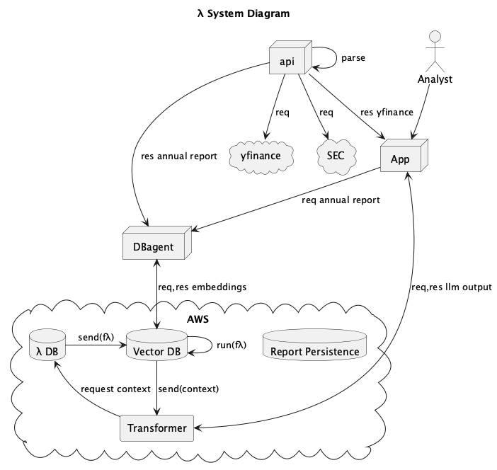
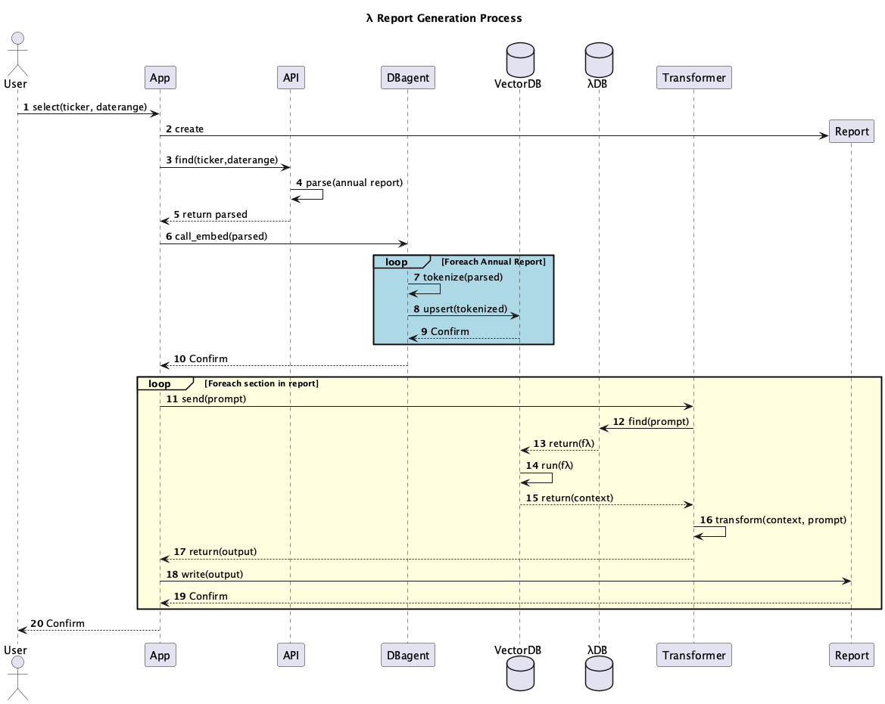

[](README.fr.md)
[](README.md)

# TENKAWS (10K-AWS) : Plateforme d'Analyse de Rapports Annuels Assistée par l'IA

<div align="center">

[](https://www.python.org/)
[](https://aws.amazon.com/)
[](https://www.anthropic.com/)
[](https://www.sec.gov/edgar)
[](https://www.trychroma.com/)

</div>

## 🏆 Équipe 28

| Membre          | Profil GitHub |
|-----------------|---------------|
| Anthony Boileau | [anthony-boileau](https://github.com/anthony-boileau) |
| Guillaume Collin | [Guillaume1208](https://github.com/Guillaume1208) |
| Minh Huynh      | [vibqetowi](https://github.com/vibqetowi) |

## 🎯 Présentation du Projet

TENKAWS révolutionne l'analyse financière en transformant les rapports annuels américains complexes (formulaire SEC 10-K) en informations exploitables grâce à l'IA générative. Notre plateforme simplifie l'analyse des documents 10-K en offrant :

- L'analyse automatisée des documents
- Des comparaisons historiques approfondies
- Des analyses techniques détaillées
- Des interactions en langage naturel

Ces fonctionnalités rendent l'analyse financière plus accessible et efficace pour les investisseurs, analystes et décideurs.

### Aperçu de la Plateforme

<div align="center">


</div>

#### Analyses IA avec Citations Sources


#### Chat Interactif avec Base de Connaissances


#### Analyse Financière Complète


### 🌟 Fonctionnalités Principales

#### Analyse Automatique des Rapports

Notre solution offre un accès gratuit aux éléments textuels analysés des formulaires 10-K, en extrayant les informations clés des documents SEC EDGAR dans un format JSON structuré :

```json
{
  "ticker": "MA",
  "year": 2018,
  "items": [
    {
      "item": "Item 3.",
      "description": "Legal Proceedings",
      "content": [
        "ITEM 3. LEGAL PROCEEDINGS Refer to Notes 10 (Accrued Expenses and Accrued Litigation) and 18 (Legal and Regulatory Proceedings) to the consolidated financial statements included in Part II, Item 8."
      ]
    },
    {
      "item": "Item 4.",
      "description": "Mine Safety Disclosures",
      "content": ["ITEM 4. MINE SAFETY DISCLOSURES Not applicable."]
    }
  ]
}
```

#### Suite d'Analyses Avancées

Notre package analytique comprend :

- **Analyse Historique** : Comparaison des métriques quantitatives et qualitatives à travers les années via LLM et recherche vectorielle
- **Q&R Interactive** : Requêtes en langage naturel propulsées par Claude 3
- **Analyses Complètes** : Aperçus détaillés des finances à la gouvernance
- **Données de Marché en Direct** : Contexte de marché en temps réel via yfinance

## 🏗️ Architecture

### Stack Technique

Conformément aux exigences du défi, chaque composant fonctionne ou est conçu pour fonctionner sur AWS. Malgré les contraintes de permissions, l'architecture a été conçue pour un déploiement AWS transparent :

- **Modèle d'IA** : Claude 3 par Anthropic, déployé sur AWS
  - Exploite des capacités robustes
  - Permet l'auto-prompting sophistiqué

- **Base de Données** : ChromaDB
  - Base de données vectorielle open-source compatible AWS
  - Actuellement en local en raison des restrictions AWS
  - Stack AWS créé avec succès (voir [notre template](./json/reference/chroma-template.json))
  - Code prêt pour le cloud
    

- **Frontend/API** : Streamlit
  - Optimisé pour Python
  - Développement rapide

- **Sources de Données** : SEC EDGAR et yfinance
  - Accès fiable et gratuit aux données financières

### Architecture Système

Les diagrammes suivants ont été générés avec PlantUML et suivent la syntaxe UML :


## 📊 Composants du Rapport

### Analyse Financière
- Métriques et fondamentaux de l'entreprise
- Suivi des performances historiques
- Comparaisons sectorielles
- Suivi des KPI
- Analyse du positionnement marché

### Leadership & Gouvernance
- Analyse de la composition du conseil
- Profils des dirigeants
- Évaluation de la structure des comités
- Analyse des rémunérations
- Indicateurs DE&I

### Évaluation des Risques
- Identification et suivi des facteurs de risque
- Évolution des patterns de risque
- Évaluation des stratégies d'atténuation
- Analyse d'impact

## 🚀 Démarrage

```bash
# Installation des dépendances
pip install -r requirements.txt

# Configuration AWS
aws configure

# Lancement de l'application
streamlit run 👋_Landing_Page.py
```

## Explicabilité de l'IA

Notre système assure la précision grâce à un suivi rigoureux des sources. Chaque extrait de texte dans la base de données vectorielle inclut des métadonnées sources. L'IA est programmée pour fournir des citations précises, renforçant les protections naturelles de Claude 3 contre les hallucinations.

Bien que l'optimisation des tokens reste à améliorer, notre système de citation précise surpasse de nombreuses solutions commerciales qui peinent avec l'hallucination des sources.

Structure de base de données exemple :

```json
[
  {
    "metadata": {
      "year": 2020,
      "ticker": "JAMEIL",
      "item": "Item 1."
    },
    "content": "Jameil is a food business, we sell breakfast cereal in Algeria"
  },
  {
    "metadata": {
      "year": 2021,
      "ticker": "JAMEIL",
      "item": "Item 1A."
    },
    "content": "The company expanded operations to Morocco and Tunisia. Revenue grew 25% year over year."
  }
]
```

Exemple de Q&R :

```
Q : Que vend Jameil ?
R : Jameil est une entreprise alimentaire qui vend des céréales pour le petit-déjeuner. Elle se concentre sur la fourniture d'options de petit-déjeuner abordables en Afrique du Nord, particulièrement en Algérie (rapport annuel 2020, Item 1).

Q : Qui est le PDG de Jameil ?
R : Les sources disponibles ne mentionnent pas le PDG de Jameil. Elles indiquent uniquement que Jameil est une entreprise alimentaire vendant des céréales en Algérie, se concentrant sur des options de petit-déjeuner abordables en Afrique du Nord. Aucune information sur la direction n'est fournie.
```

Notre base de données vectorielle stocke environ 32 mots par vecteur selon la longueur de la dernière phrase. Le critère de séparation actuel est un simple comptage de mots.

## 📈 Métriques de Performance

Testé sur MacBook Air, avec le module time Python sur un échantillon aléatoire de 10 éléments :

| Métrique | Performance |
|----------|-------------|
| Analyse du rapport annuel vers JSON | $\hat{\mu} = 3.635s, \hat{\sigma} = 1.418s$ |
| Intégration dans ChromaDB local | $\hat{\mu} = 131.03s, \hat{\sigma} = 65.62s$ |
| Récupération du contexte et réponse IA | $\hat{\mu} = 4.69s, \hat{\sigma} = 1.28s$ |

## 🛣️ Développements Futurs

### Plan de Route
- Implémentation de l'analyse de sentiment médias/réseaux sociaux
- Conversion des appels bloquants en asynchrone
- Déploiement d'instances de base de données et optimisation des performances
- Analyse sémantique des formulaires 10-K
- Implémentation de la persistance des rapports générés
- Ajout des comparaisons entre entreprises et analyses historiques

### Traitement des Requêtes Avancées

Actuellement, l'agent Transformer fonctionne avec un préprompt basique et une recherche sémantique simple. Si cela fonctionne pour les requêtes simples (ex: "Qui est le PDG d'Apple ?"), il peine avec des questions plus complexes nécessitant un contexte historique (ex: "Depuis combien de temps Tim Cook est-il PDG d'Apple ?").

Nos observations montrent que les requêtes nécessitant un contexte historique et des comparaisons multi-aspects ne peuvent être traitées par simple ingénierie de prompt. Cette limitation affecte nos sections IA et le chatbot, qui s'appuient uniquement sur la similarité vectorielle.

#### Architecture Proposée

En raison des contraintes AWS Bedrock, nous avons dû adapter notre architecture initiale. Le concept original incluait :

1. Un système sophistiqué où le Transformer interrogerait d'abord une base de données de fonctions λ associées à des types de requêtes
2. Le système utiliserait ensuite la recherche sémantique pour identifier et exécuter la fonction λ la plus appropriée

L'architecture améliorée est illustrée ici :




## 📜 Licence

Ce projet est sous licence GPL - voir le fichier [LICENSE](LICENSE) pour plus de détails.

---

<div align="center">

*Créé avec ❤️ lors du Datathon Polyfinance 2024*

</div>