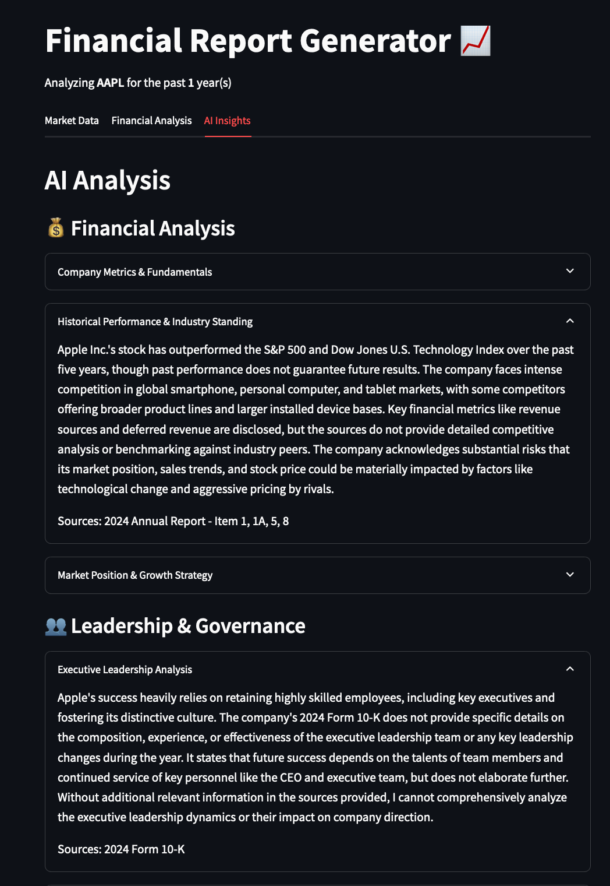
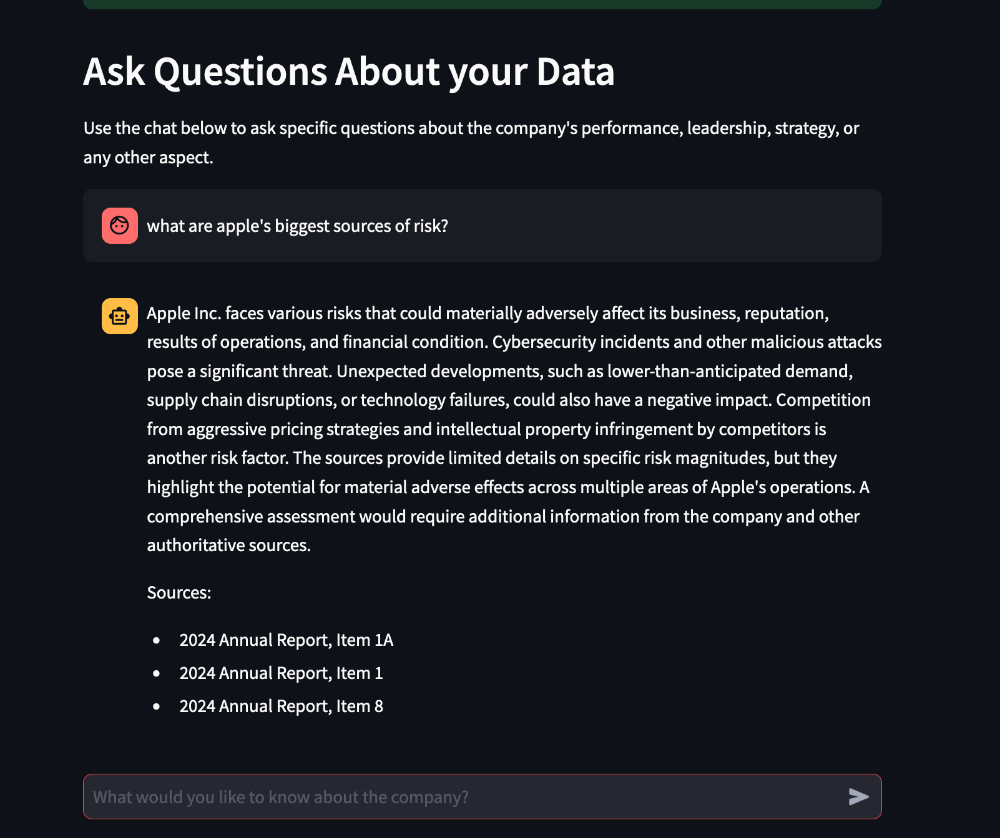

[](README.fr.md)
# TENKAWS (10K-AWS): AI-Powered Annual Report Analysis Platform
<div align="center">

[](https://www.python.org/)
[](https://aws.amazon.com/)
[](https://www.anthropic.com/)
[](https://www.sec.gov/edgar)
[](https://www.trychroma.com/)

</div>

## 🏆 Team 28

| Team Member      | GitHub Profile                                        |
| ---------------- | ----------------------------------------------------- |
| Anthony Boileau  | [anthony-boileau](https://github.com/anthony-boileau) |
| Guillaume Collin | [Guillaume1208](https://github.com/Guillaume1208)     |
| Minh Huynh       | [vibqetowi](https://github.com/vibqetowi)             |

## 🎯 Project Overview

TENKAWS revolutionizes financial analysis by transforming complex US annual reports (SEC Form 10-K) into actionable insights through the power of generative AI. Our platform streamlines the analysis of SEC 10-K filings by providing:

- Automated document parsing and structuring
- Comprehensive historical comparisons
- In-depth technical analyses
- Natural language Q&A capabilities

Through these features, we make financial analysis more accessible and efficient for investors, analysts, and decision-makers.

### Platform Showcase

<div align="center">


</div>

#### AI-Powered Insights with Source Citations



#### Interactive Knowledge Base Chat



#### Comprehensive Financial Analysis


### 🌟 Key Features

#### Automated Report Parsing

Our solution offers free access to parsed textual components of 10-K forms, extracting key information from SEC EDGAR filings into a structured JSON format:

```json
{
  "ticker": "MA",
  "year": 2018,
  "items": [
    {
      "item": "Item 3.",
      "description": "Legal Proceedings",
      "content": [
        "ITEM 3. LEGAL PROCEEDINGS Refer to Notes 10 (Accrued Expenses and Accrued Litigation) and 18 (Legal and Regulatory Proceedings) to the consolidated financial statements included in Part II, Item 8."
      ]
    },
    {
      "item": "Item 4.",
      "description": "Mine Safety Disclosures",
      "content": ["ITEM 4. MINE SAFETY DISCLOSURES Not applicable."]
    }
  ]
}
```

#### Advanced Analytics Suite

Our comprehensive analytics package includes:

- **Historical Analysis**: Compare quantitative metrics and qualitative aspects across multiple years through LLM and vector database search
- **Interactive Q&A**: Natural language queries powered by Claude 3
- **Comprehensive Analytics**: Deep insights from financials to governance
- **Real-time Market Data**: Live market context through yfinance integration

## 🏗️ Architecture

### Technology Stack

Per challenge requirements, every component either runs on or is designed to run on AWS. Despite permission constraints, the architecture was designed for seamless AWS deployment:

- **AI Model**: Claude 3 by Anthropic, deployed on AWS

  - Leverages robust capabilities
  - Enables sophisticated self-prompting engineering the

- **Database**: ChromaDB

  - Open-source vector database with AWS deployment support
  - Currently running locally due to AWS permission issues
  - AWS stack successfully created (see [our template](./json/reference/chroma-template.json))
  - Code ready for cloud adaptation
    

- **Frontend/API**: Streamlit

  - Optimized for Python integration
  - Rapid development capabilities

- **Data Sources**: SEC EDGAR and yfinance

  - Reliable, free access to financial data

### System Architecture

The following diagrams were generated with PlantUML and loosely follow the UML syntax:


## 📊 Report Components

### Financial Analysis

- Company metrics and fundamentals
- Historical performance tracking
- Industry comparisons
- KPI monitoring
- Market positioning analysis

### Leadership & Governance

- Board composition insights
- Executive leadership profiles
- Committee structure evaluation
- Compensation analysis
- DE&I metrics tracking

### Risk Assessment

- Risk factor identification and tracking
- Evolution of risk patterns
- Mitigation strategy evaluation
- Impact analysis

## 🚀 Getting Started

```bash
# Install dependencies
pip install -r requirements.txt

# Configure AWS credentials
aws configure

# Launch application
streamlit run 👋_Landing_Page.py
```

## AI Explainability

We aim to provide assurance of accuracy through meticulous source tracking. Each text snippet in the vector database includes source metadata. The LLM is prompted to return precise citations, enhancing Claude 3's natural safeguards against hallucinations.

While token usage optimization remains an area for improvement, our precise citation system outperforms many commercial solutions that struggle with source hallucination.

Example database structure:

```json
[
  {
    "metadata": {
      "year": 2020,
      "ticker": "JAMEIL",
      "item": "Item 1."
    },
    "content": "Jameil is a food business, we sell breakfast cereal in Algeria"
  },
  {
    "metadata": {
      "year": 2021,
      "ticker": "JAMEIL",
      "item": "Item 1A."
    },
    "content": "The company expanded operations to Morocco and Tunisia. Revenue grew 25% year over year."
  }
]
```

Sample Q&A:

```
Q: What does Jameil sell?
A: Jameil is a food business that sells breakfast cereal. It focuses on providing affordable breakfast options to markets in North Africa, specifically Algeria (2020 annual report, Item 1).

Q: Who is Jameil's CEO?
A: The provided source does not mention the CEO of Jameil. It only states that Jameil is a food business that sells breakfast cereal in Algeria, focusing on providing affordable breakfast options to North African markets. There is no information given about the company's leadership or CEO.
```

Our vector database stores approximately 32 words per vector depending on the length of the last sentence it stores. The current separation criteria is simple word count.

## 📈 Performance Metrics

Tested on a MacBook Air, using Python's time module to measure query times on a random sample of 10 items:

| Metric                                     | Performance                                  |
| ------------------------------------------ | -------------------------------------------- |
| Annual Report to JSON parsing time         | $\hat{\mu} = 3.635s, \hat{\sigma} = 1.418s$  |
| Embedding annual report to local ChromaDB  | $\hat{\mu} = 131.03s, \hat{\sigma} = 65.62s$ |
| Retrieving context and answering LLM query | $\hat{\mu} = 4.69s, \hat{\sigma} = 1.28s$    |

## 🛣️ Roadmap

- Implement news/social media sentiment analysis insights
- Convert remaining blocking calls to async operations
- Deploy hosted database instances and optimize embedding performance
- Parse 10-k forms by meaning to store complete ideas in vectors
- Implement persistence within app sessions (currently navigating away resets AI-generated sections)
- Add capability to compare companies

## 📜 License

This project is licensed under the GPL License - see the [LICENSE](LICENSE) file for details.

---

<div align="center">

_Built with ❤️ during the Polyfinance 2024 Datathon_

</div>
